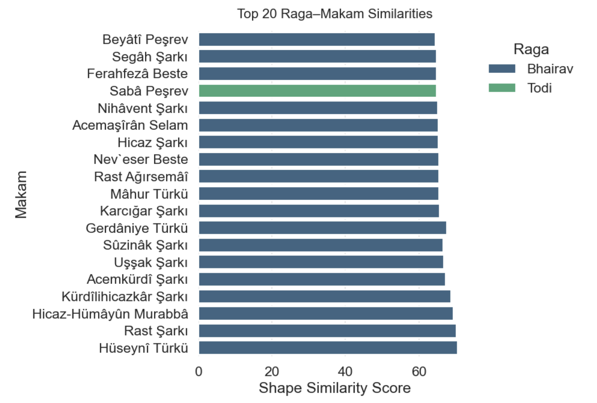
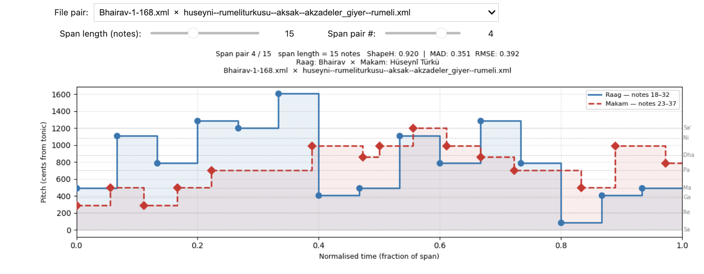
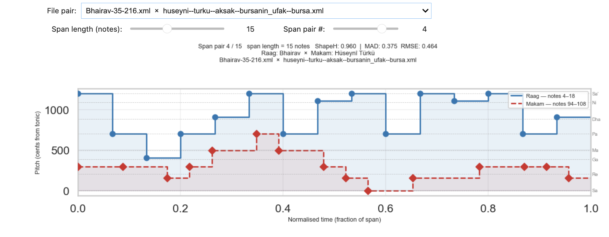
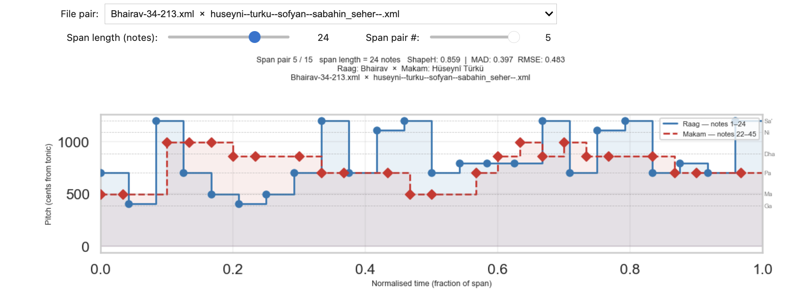
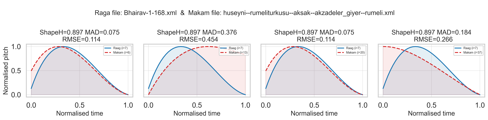
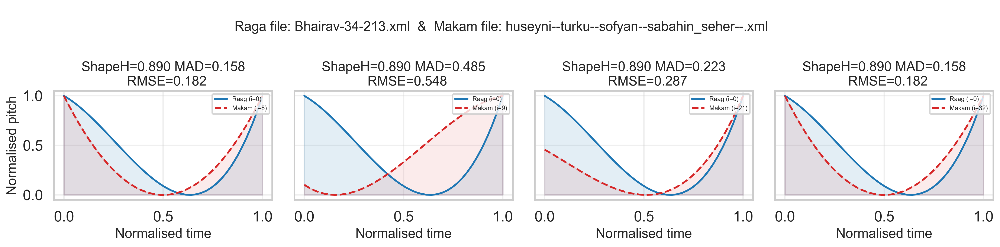
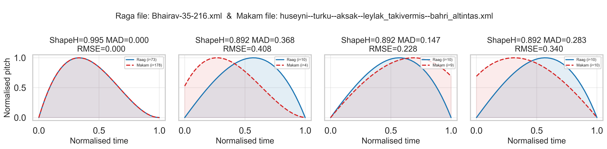
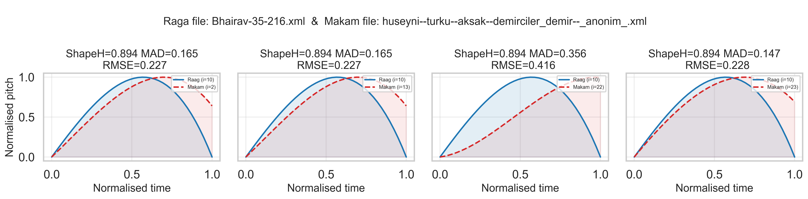

# Comparative analysis of Makams and Ragas

Symbolic analysis and comparative study of Turkish makams and Hindustani ragas.

This repository provides:

- Parsers for Hindustani Swarlipi XML and Turkish MusicXML.
- Pitch and duration extraction from symbolic notation.
- Cross-corpus melodic similarity using a MelodyShape-inspired implementation.
- Batch comparison scripts and aggregate CSV outputs.
- A ShapeTime workflow focused on Raag Bhairav vs all makams.

## Repository Structure

- `raga/`
	- `parser.py`: Swarlipi XML parser and ornament/laya statistics utilities.
	- `pitch_extractor.py`: converts Swarlipi notation to note events and pitch curves; exposes `load_raga_notes(...)`.
	- `notation.md`: documentation of notation symbols used in the raga corpus.
- `makam/`
	- `parser.py`: MusicXML parser for metadata, pitch, duration, and tonic extraction.
	- `pitch_extractor.py`: pitch-curve extraction; exposes `load_makam_notes(...)` for similarity input.
- `analysis/`
	- `melodyshape.py`: span construction, ShapeH, Time, and hybrid alignment.
	- `run_comparison.py`: all-pairs comparison between ragas and makams.
	- `run_shapetime_bhairav.py`: ShapeTime pipeline for Bhairav.
	- `plot_shapetime_analysis.py`: plotting utilities for ShapeTime CSV outputs.
	- `output/`: generated CSV files.
- `datasets/`
	- `ragas/`: Swarlipi XML corpus.
	- `makams/`: Turkish makam MusicXML corpus.
- Notebooks
	- `raga-notebook.ipynb`
	- `makam-notebook.ipynb`
	- `phrase-similarity.ipynb`

## Environment Setup

### 1) Create and activate a virtual environment

```bash
python3 -m venv .venv
source .venv/bin/activate
```

### 2) Install dependencies

```bash
pip install -r requirements.txt
```

## Data and Representation

### Hindustani (Raga) pipeline

- Swarlipi XML is parsed from `SHEET/LINES/LINE/ROW/COL/CONTENT` nodes.
- Notes are mapped with just-intonation ratios relative to tonic (`Sa`).
- Output for similarity: sequence of `(pitch_cents, duration)` from `load_raga_notes(...)`.
- Ornaments and laya markers are handled at parse/token level (meend symbols, murki, chhand markers, etc.).

### Turkish (Makam) pipeline

- MusicXML notes are converted to absolute semitone values (including `alter` microtonal offsets).
- Tonic is approximated as the last pitched note (karar proxy).
- Output for similarity: sequence of `(pitch_cents_relative_to_tonic, duration)` from `load_makam_notes(...)`.

## Similarity Methods

Implemented in `analysis/melodyshape.py`.

- **ShapeH**
	- Builds 3-note spans.
	- Uses derivative-sign shape classes at span boundaries.
	- Uses corpus frequency weighting from makam spans.
- **Time**
	- Builds 4-note spans.
	- Compares continuous derivative curves of pitch/time polynomials.
- **Hybrid alignment**
	- Dynamic-programming sequence alignment with insertion/deletion/substitution scoring.
	- Returns best score over the DP table.

## Running the Analysis

Run commands from the repository root.

### A) Full pairwise comparison (ragas x makams)

```bash
python analysis/run_comparison.py \
	--system shapetime \
	--out-dir analysis/output \
	--top-k 5 \
	--shapetime-top-k 10
```

Notes:

- `--system` options: `shapeh`, `time`, `shapetime`.
- Use `--limit-ragas` / `--limit-makams` for quick experiments.
- You can filter makams with `--makam-name`, `--makam-usul`, or `--makam-file`.
- The script default for `--out-dir` is `ai-code/output`; passing `--out-dir analysis/output` keeps outputs in this repo's analysis folder.

### B) Bhairav-focused ShapeTime workflow

```bash
python analysis/run_shapetime_bhairav.py --top-k 10
```

This script:

1. Loads only files matching `datasets/ragas/Bhairav-*.xml`.
2. Computes ShapeH against all makams.
3. Re-ranks top-k (plus score ties) using Time.
4. Writes detailed and aggregated CSV files.

### C) Plot ShapeTime results

```bash
python analysis/plot_shapetime_analysis.py \
	--data-dir analysis/output/shapetime \
	--output-dir analysis/output/shapetime/plots \
	--top-n 15
```

## Plots and Visualizations

### Top 20 Raga-Makam Similarities



### Pitch Curve Comparisons







### Shape Similarity Plots









## Reference Papers

- “A study of the Raga Zeelaf and its relationship with Arabian traditional music”, A. Bhattacharya and D. K. Das, The Journal of Acoustical Society of India, vol. 50, no. 3–4, pp. 121–127, 2023.
- “Aspects generating variety in eastern melodic multimodality”, M. Skoulios,  in Minutes of the 2017 Arel Symposium, Istanbul, Turkey, December 2018
- “MelodyShape at MIREX 2014 symbolic melodic similarity”, J. Urbano, in 10th Music Information Re trieval Evaluation eXchange (MIREX 2014), Taipei, Taiwan, October 2014
- “A comparison of symbolic similarity measures for finding occurrences of melodic segments” P. Janssen, P. Van Kranenburg, and A. Volk
